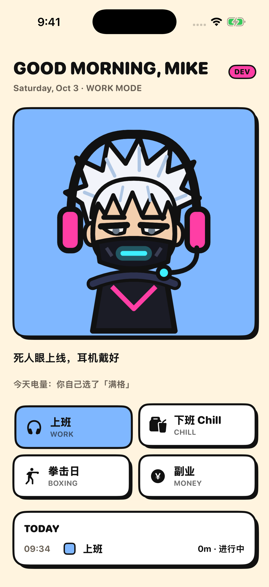
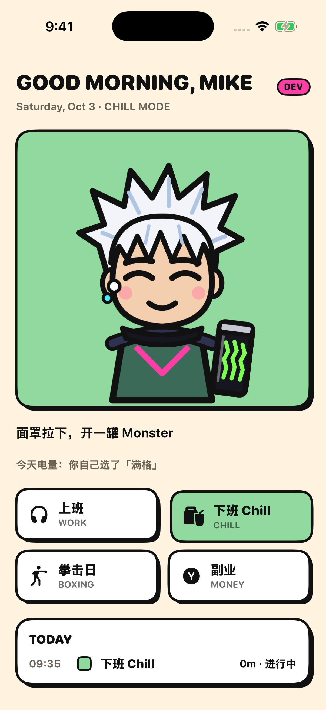
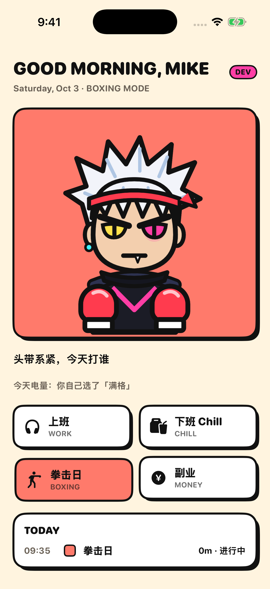
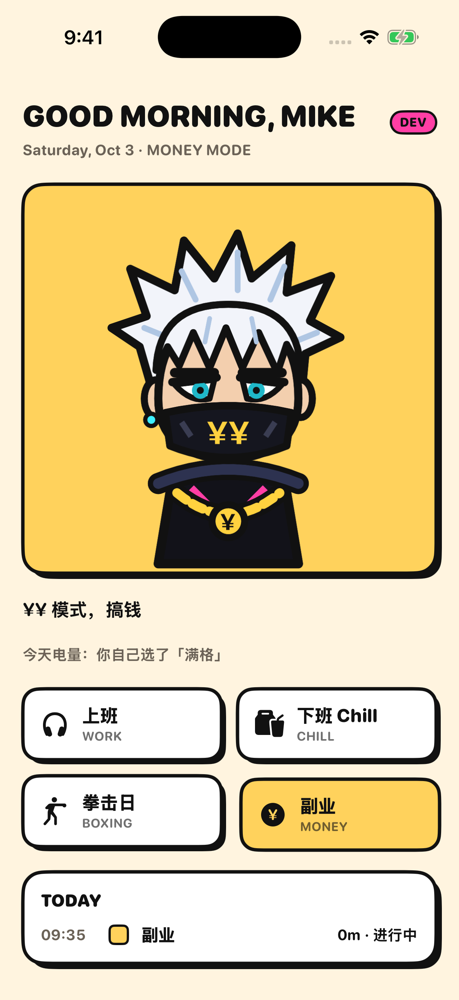
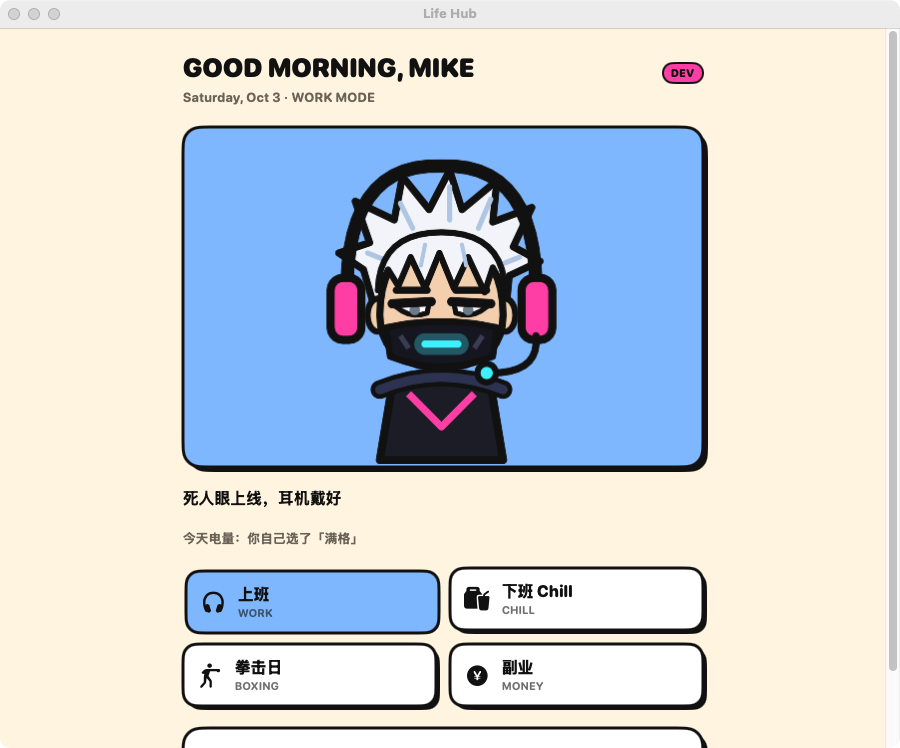
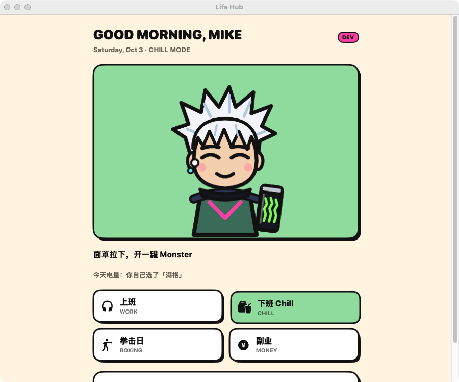
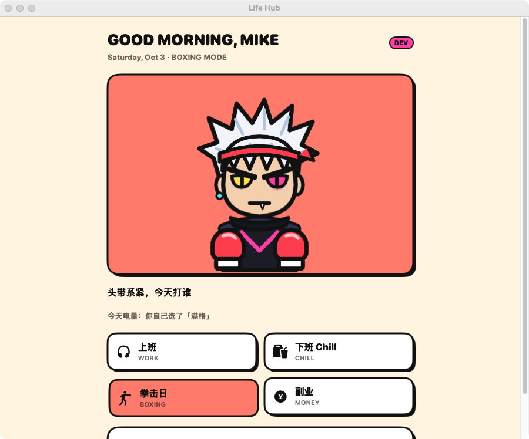
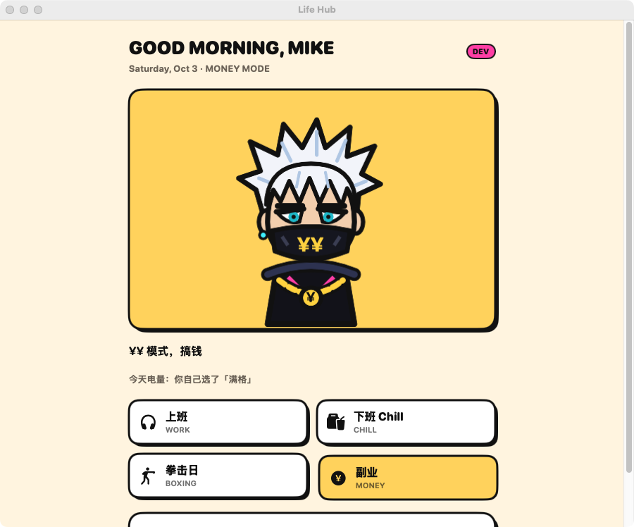

# Life Hub

Mike 自用的生活 hub，iOS + Mac。companion RUNNER 跟着当前 mode（上班 / Chill / 拳击日 / 副业）变。

| | 上班 | Chill | 拳击日 | 副业 |
|---|---|---|---|---|
| iPhone |  |  |  |  |
| Mac |  |  |  |  |

截图由 GitHub Actions 的 `screenshots` workflow 生成（本地：`make screenshots`）。在分支上手动运行它，图会提交回那个分支，再走 PR 合进 main。

## 跑起来

```bash
brew install xcodegen      # 只需一次
make open                  # 生成 LifeHub.xcodeproj 并用 Xcode 打开
```

在 Xcode 里选 `LifeHub-iOS`（模拟器或你的 iPhone）或 `LifeHub-macOS`，点运行。在真机上运行要先在 Signing & Capabilities 里选你的 Team。

## 文档

`docs/` 里是 Obsidian 格式的项目文档，可以直接复制进 vault：

- `docs/03 Product/Hub PRD.md`：功能设计
- `docs/05 Engineering/技术架构.md`：技术架构
- `docs/05 Engineering/范围文档.md`：当前范围、不做什么、停止条件
- `docs/05 Engineering/副业平台可行性.md`：小红书 / 抖音能做什么
- `docs/03 Product/companion/`：RUNNER 的 SVG 和 Rive 搭建步骤
- `docs/00 Lessons/经验索引.md`：旧项目经验的场景索引，做每一步前先查

给 Claude Code 的工程规则在 `CLAUDE.md`。
